# GOGO POD 前台用户端 - 产品需求文档（开发详版）

> 本文档在原《PRD-GOGOPOD-前台.md》基础上做“面向研发可落地”的细化：补齐页面/流程/数据结构/API/异常与验收标准，并为每个一级模块提供可视化“图片说明”（Mermaid 流程/结构图，渲染后即为图）。

## 0. 文档信息

- 产品：GOGO POD（POD AI 电商设计工作台）
- 端：前台用户端（Web）
- 面向读者：产品 / 前端 / 后端 / 测试 / 运营
- 关联文档：
  - 原 PRD：`docs/PRD-GOGOPOD-前台.md`
  - 管理后台 PRD：`docs/PRD-GOGOPOD-管理后台.md`
  - 管理端说明（动态表单/预设等）：`docs/后台管理说明.md`

## 1. 背景与目标

### 1.1 背景

GOGO POD 面向 POD（Print on Demand）卖家提供从素材获取到多平台刊登的一站式链路，核心差异点为：

1. **垂类 AI 能力集合**：围绕 POD 图像生产场景（提取、抠图、裂变、套图等）。
2. **可视化工作流（Workflow）**：将多个 AI 节点串成批处理流水线，提升上新效率。
3. **资产化与分发**：结果进入素材/商品库，支撑多平台上架。

### 1.2 本期目标（研发可验收）

- 用户可完成“采集/上传 → AI 处理（单功能/工作流）→ 资产入库 →（可选）刊登”闭环。
- 任务中心可追踪所有任务的状态、输入/输出、失败原因、重试与再创作。
- 官方模板（工作流模板、套图模板、推荐案例）可从管理端下发并在前台可见可用。

### 1.3 非目标（明确不做/后续迭代）

- 不实现完整支付/订阅计费（如有商业化需求另行 PRD）。
- 不实现真正的“多平台自动刊登”对接细节（可先做模板化导出/半自动）。

## 2. 术语与对象定义

- **素材（Asset）**：用户上传/采集/生成得到的图片、视频等文件。
- **任务（Task）**：一次 AI 执行单元（单功能任务或工作流任务），具备输入、参数、状态、输出与日志。
- **工作流（Workflow）**：由多个节点组成的 DAG/流程；运行时生成一个 WorkflowRun（可映射为一组 Task）。
- **模板（Template）**：可复用配置，包含 WorkflowTemplate、ProductSetTemplate、Recommendation 等。
- **预设（Preset）**：某功能的场景化参数与提示词组合（由管理端配置，下发前台用于动态表单/Prompt 合成）。

## 3. 角色与权限（前台）

| 角色 | 描述 | 前台权限 |
|---|---|---|
| 普通用户 | 默认用户 | 可使用其账号授权范围内的功能；受限额与风控影响 |
| 演示/试用用户 | 运营开设 | 功能/次数/水印等可由后端策略控制 |
| 团队成员（可选） | 若支持团队空间 | 访问团队模板/资产（本期可不做） |

> 说明：管理端 RBAC 见管理后台 PRD；前台侧只需展示“权限不足/超限”与引导。

## 4. 整体用户旅程（端到端流程）

### 4.1 用户主流程（图片说明）

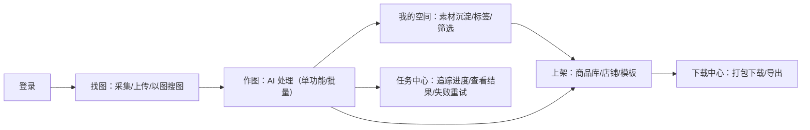

### 4.2 页面与路由（建议）

> 与现有代码文件命名保持一致（示例）。路由仅作参考，最终以前端实现为准。

| 一级模块 | 主要页面 | 路由示例 | 备注（代码引用） |
|---|---|---|---|
| 登录 | 登录页 | `/login` | `FrontendLoginPage` |
| 首页/工作流 | 工作流首页 / Builder / 模板库 | `/workflow` `/workflow/builder` `/workflow/templates` | `WorkflowPage.tsx` 等 |
| 找图 | 采集任务列表 / 以图搜图 | `/find-image` | `FindImagePage.tsx` |
| 作图 | 功能集合页 + 各功能子页/弹窗 | `/design/*` | `DesignPage.tsx` |
| 视频 | 视频生成列表/弹窗 | `/video` | `VideoPage.tsx` |
| 上架 | 商品库/店铺/刊登模板 | `/publish/*` | `PublishPage.tsx` |
| 我的空间 | 资产网格 | `/my-space` | `MySpacePage.tsx` |
| 任务中心 | 列表/详情 | `/tasks` `/tasks/:id` | `TaskCenterPage.tsx` |
| 下载中心 | 下载记录 | `/downloads` | `DownloadsPage.tsx`（若有） |

## 5. 全局能力（壳层/通用）

### 5.1 顶栏与全局搜索（⌘K）

**目标**：快速导航到功能、模板、最近任务、最近资产。

**搜索范围**（可先做本地数据/后端聚合）：
- 功能入口（固定菜单）
- 最近任务（最近 N 条）
- 最近资产（最近 N 条）
- 模板（官方/我的）

**验收标准**：
- 键盘 `⌘K / Ctrl+K` 可唤起，Esc 关闭；
- 输入关键字可筛选并 Enter 跳转；
- 无数据时展示空态与引导。

### 5.2 通用任务进度反馈

**目标**：任何 AI 任务启动后，用户能在：
1) 页面内局部进度条/Toast；2) 任务中心列表；3)（可选）顶部“进行中”聚合入口 中看到进度。

**状态模型**（统一）：
- `queued` 排队中
- `running` 执行中（可有百分比）
- `succeeded` 成功
- `failed` 失败（带错误码/错误信息/可重试标记）
- `canceled` 已取消（可选）

## 6. 模块详述（每个模块含“图片说明”）

> 章节结构统一：概述 → 入口/页面 → 核心流程（图片）→ 功能点 → 数据结构（建议）→ API（建议）→ 异常与边界 → 验收标准（DoD）→ 埋点（建议）。

---

## 6.1 登录（FrontendLoginPage）

### 概述
提供账号密码登录，成功后进入 `/workflow`。

### 核心流程（图片说明）

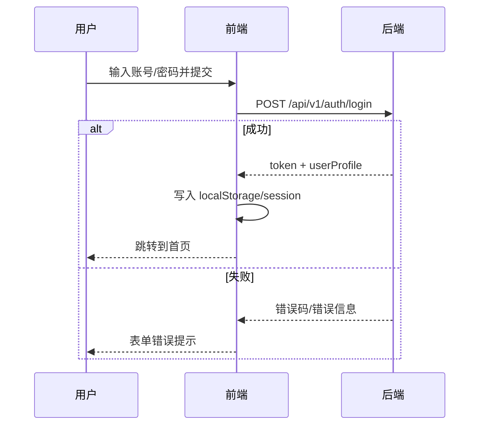

### 本地存储（现状/建议）

- 现状（来自原 PRD）：`localStorage` 使用
  - `pod_frontend_users`
  - `pod_frontend_session`
- 建议：后续统一为 `pod_session`（token、过期时间、用户 id、刷新 token）。

### API（建议）

| 接口 | 方法 | 请求 | 响应 |
|---|---|---|---|
| `/api/v1/auth/login` | POST | `{email, password}` | `{token, expiresAt, user}` |
| `/api/v1/auth/logout` | POST | header: Authorization | `{ok:true}` |
| `/api/v1/auth/me` | GET | header: Authorization | `{user}` |

### 验收标准（DoD）

- 登录成功后刷新页面仍保持登录态；
- token 失效时统一跳转登录并提示“登录过期”；
- 密码错误/账号不存在提示清晰，不泄露敏感信息（统一文案）。

---

## 6.2 首页与工作流（Workflow / Builder / Templates）

### 概述
- 工作流首页：欢迎区、快速开始、最近任务追踪、推荐玩法与案例展示。
- Builder：节点拖拽编排，右侧面板配置节点参数。
- 模板库：官方模板/团队模板/我的模板，一键复用并运行。

### 页面与入口
- `WorkflowPage.tsx`：入口页（推荐玩法、最近任务、快捷创建）
- `WorkflowBuilderPage.tsx`：画布式编排
- `WorkflowTemplatesPage.tsx`：模板库

### 工作流编排（图片说明）

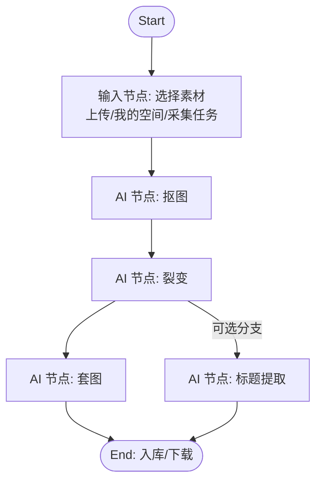

### 功能点（需要明确的可实现规则）

1. **节点类型**
   - 输入：上传/从我的空间选择/从采集任务选择
   - AI：8 大能力节点（见作图模块），视频（可独立）
   - 输出：入库（我的空间/商品库）、下载打包、导出（可选）
2. **参数配置**
   - 每个 AI 节点参数由“预设（Preset）”驱动：默认值、控件类型、提示词片段合成（若适用）。
3. **运行与批量**
   - 运行一次产生 `workflowRunId`，包含多个 task；
   - 输入素材多张时：按素材维度批量产生子任务（需明确并发上限）。
4. **保存与复用**
   - 保存为“我的工作流”（私有）
   - 另存为模板（若支持团队/分享，另行）

### 数据结构（建议）

```ts
// Workflow 定义（保存态）
type Workflow = {
  id: string
  name: string
  description?: string
  nodes: WorkflowNode[]
  edges: { from: string; to: string }[]
  createdAt: string
  updatedAt: string
}

type WorkflowNode =
  | { id: string; type: "input"; config: InputConfig }
  | { id: string; type: "feature"; featureKey: FeatureKey; presetId: string; params: Record<string, any> }
  | { id: string; type: "output"; config: OutputConfig }

type FeatureKey =
  | "pattern_extract"
  | "cutout"
  | "crack_image"
  | "text_to_image"
  | "product_set"
  | "vector"
  | "infringement_filter"
  | "title_extract"
  | "video_generate"
```

### API（建议）

| 接口 | 方法 | 说明 |
|---|---|---|
| `/api/v1/workflows` | GET/POST | 列表/创建 |
| `/api/v1/workflows/:id` | GET/PUT/DELETE | 详情/更新/删除 |
| `/api/v1/workflows/:id/run` | POST | 运行工作流，返回 `workflowRunId` |
| `/api/v1/workflow-runs/:id` | GET | 运行详情（tasks 列表、进度聚合） |
| `/api/v1/templates/workflow` | GET | 拉取官方工作流模板 |

### 异常与边界

- 节点参数缺失：禁止运行并定位到缺失节点；
- 输入素材为空：禁止运行；
- 运行中重复点击：提示“已在运行”，并允许跳转任务中心；
- 并发限制：超限提示与排队策略一致（后端返回 `429/limit_exceeded`）。

### 验收标准（DoD）

- 可新增/删除/连线节点并保存；
- 可从模板一键创建工作流并运行；
- 运行后可在任务中心看到拆分后的任务及进度；
- 任一子任务失败可定位失败节点与原因（至少显示错误信息）。

---

## 6.3 找图（Find Image：采集与以图搜图）

### 概述
包含：
1) 浏览器插件采集同步；2) 采集任务列表；3) 以图搜图跳外链。

### 核心流程（图片说明）

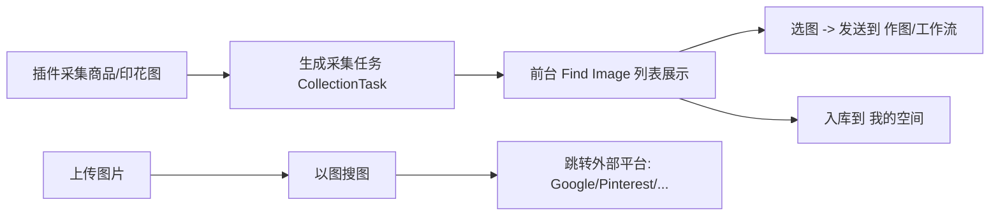

### 功能点

- 采集任务列表
  - 展示：来源站点、采集时间、图片数、状态（同步中/完成/失败）
  - 操作：查看详情、批量选择、入库、发送到作图/工作流
- 以图搜图
  - 图片来源：本地上传 / 我的空间选择 / 采集任务选择
  - 输出：打开新标签页跳转（携带搜索图 URL 或提示用户手动上传）

### 数据结构（建议）

```ts
type CollectionTask = {
  id: string
  source: "chrome_extension"
  sourceSite?: string
  title?: string
  createdAt: string
  status: "syncing" | "done" | "failed"
  items: { assetId: string; thumbnailUrl: string }[]
}
```

### API（建议）

| 接口 | 方法 | 说明 |
|---|---|---|
| `/api/v1/collection-tasks` | GET | 列表 |
| `/api/v1/collection-tasks/:id` | GET | 详情（含 items） |
| `/api/v1/assets/import` | POST | 将采集项批量入库到我的空间 |

### 验收标准（DoD）

- 插件采集数据能在列表中出现（至少 mock 跑通）；
- 可将采集图片一键发送到“作图-某功能”或“工作流输入”；
- 以图搜图入口可用，且不会阻塞主流程（新标签打开）。

---

## 6.4 作图（Design：8 大 AI 图像能力）

### 概述
作图模块是核心生产力区，提供 8 项 AI 能力，均支持：
- 单次处理（单张/多张）
- 批量处理
- 进入工作流节点
- 结果对比、再创作、入库/下载

### 模块结构（图片说明）

```mermaid
flowchart TB
  D[Design 入口] --> F1[印花提取]
  D --> F2[一键抠图]
  D --> F3[图裂变]
  D --> F4[文生图]
  D --> F5[商品套图]
  D --> F6[转矢量图]
  D --> F7[侵权风险过滤]
  D --> F8[标题提取]
  subgraph 共用能力
    C1[动态表单(来自 Presets)]
    C2[任务提交/轮询/推送]
    C3[结果对比与二次操作]
  end
  F1 --- C1
  F2 --- C1
  F3 --- C1
  F4 --- C1
  F5 --- C1
  F6 --- C1
  F7 --- C1
  F8 --- C1
```

### 通用交互规范（建议统一）

1. **输入选择**
   - 本地上传（支持拖拽）
   - 从我的空间选择
   - 从采集任务选择（可选）
2. **参数面板**
   - 参数由 preset 下发生成（控件类型/默认值/可见性/子控件）
3. **提交任务**
   - 点击“开始处理”后：生成 task，跳转任务中心或在当前页展示进度
4. **结果区**
   - 输入/输出对比（左右/滑杆）
   - 批量结果网格
   - 操作：入库、下载、再创作、加入工作流

### 动态表单与 Prompt 合成（与管理端对齐）

来自 `docs/后台管理说明.md`：

```
完整提示词 = 场景基础提示词
         + 各可见控件的 promptFragment（{{value}} 替换为用户值）
         + 选中选项的 promptFragment
```

> 说明：并非所有功能都需要 prompt（如抠图可能走传统模型/参数），但表单驱动机制统一。

### 8 项能力（逐项细化的最低要求）

> 下面每个能力都应在前端体现：preset 场景 Tab、核心参数、任务输入输出、失败原因、DoD。

#### 6.4.1 印花提取（Pattern Extract）

**图片说明（流程）**
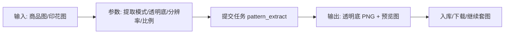

**关键参数**（示例）
- 提取模式：专项/全能
- 背景：透明/保留
- 分辨率：512/1024/2048（按后端支持）
- 比例：1:1 / 4:5 / 16:9（按后端支持）

**验收标准**
- 支持至少 1 种模式跑通；
- 输出可入库、可下载；透明底正确（若选择透明）。

#### 6.4.2 一键抠图（Cutout）

**图片说明**
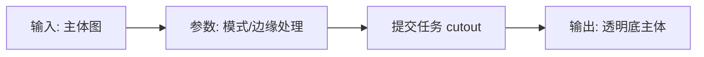

**验收标准**
- 边缘无明显黑边（可接受轻微锯齿，需定义容忍度）；
- 批量任务每张均生成独立输出。

#### 6.4.3 图裂变（Crack Image）

**图片说明**
```mermaid
flowchart TD
  A[输入: 原图] --> B[选择场景/模式(多Tab)]
  B --> C[提交任务 crack_image]
  C --> D[输出: 多张变体]
  D --> E[挑选 -> 套图/入库/再裂变]
```

**验收标准**
- 至少 1 个“默认”场景可跑通；
- 输出数量与前端选择一致（如 4/6/8 张）；
- 每张输出可单独“再创作/入库”。

#### 6.4.4 文生图（Text to Image）

**图片说明**
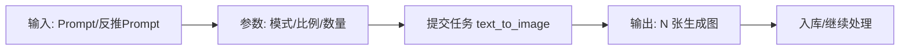

**批量导入**
- 支持 EXCEL 导入 prompt（本期可先做 CSV/粘贴多行降级方案）。

**验收标准**
- 支持生成模式至少 1 种；
- 反推提示词（如有）可用或提供占位引导。

#### 6.4.5 商品套图（Product Set）

**图片说明**
```mermaid
flowchart TD
  A[输入: 印花/主体] --> B[选择套图模板(官方/自定义)]
  B --> C[参数: 位置/缩放/印花处理(可选)]
  C --> D[提交任务 product_set]
  D --> E[输出: 商品样机套图]
```

**规则**
- 套图模板包含：底图、蒙版、推荐画布尺寸、锚点（如有）。

**验收标准**
- 至少 1 个官方模板可用；
- 合成位置符合预期（可接受小偏差，需定义坐标体系）。

#### 6.4.6 转矢量图（Vector）

**图片说明**
```mermaid
flowchart LR
  A[输入: 位图] --> B[参数: 风格(常规/黑白)]
  B --> C[提交任务 vector]
  C --> D[输出: SVG/AI/PDF(按后端)]
```

**验收标准**
- 输出为可下载文件（至少 SVG）；
- 黑白/常规至少一种可用。

#### 6.4.7 侵权风险过滤（Infringement Filter）

**图片说明**
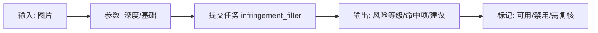

**验收标准**
- 输出包含：风险等级、命中原因（文本/视觉/Logo 等）、建议动作；
- “高风险”默认阻止进入上架（规则可配置）。

#### 6.4.8 标题提取（Title Extract）

**图片说明**
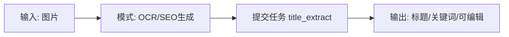

**验收标准**
- 至少 OCR 或 SEO 生成一种跑通；
- 输出可复制、可保存到商品库字段。

### 通用 API（建议）

| 接口 | 方法 | 说明 |
|---|---|---|
| `/api/v1/tasks` | POST | 创建任务（featureKey + presetId + inputs + params） |
| `/api/v1/tasks` | GET | 任务列表（支持筛选） |
| `/api/v1/tasks/:id` | GET | 任务详情（输入/输出/日志） |
| `/api/v1/tasks/:id/retry` | POST | 重试 |
| `/api/v1/tasks/:id/cancel` | POST | 取消（可选） |

---

## 6.5 视频（Video）

### 概述
将静态商品图/印花转化为动态展示视频（模特动作/商品律动/风铃飘动等）。

### 核心流程（图片说明）

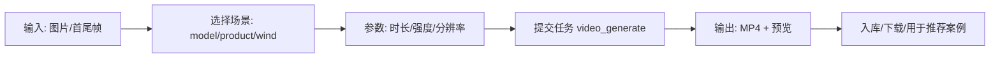

### 验收标准（DoD）
- 至少 1 个预设场景可生成可播放 MP4；
- 失败时显示可读原因（如“配额不足/模型不可用/输入不符合”）。

---

## 6.6 上架（Publish：商品库/店铺/刊登模板）

### 概述
承接“作图/视频”的最终可售卖资产，组织为商品，并支持多平台刊登模板化输出（先做半自动可落地）。

### 模块结构（图片说明）

```mermaid
flowchart TB
  A[商品库 Product Library] --> B[商品详情: 图+文案+SKU]
  B --> C[店铺管理 Shop Connections]
  B --> D[刊登模板 Listing Templates]
  D --> E[导出/一键发布(可选)]
```

### 功能点（本期可落地拆分）

1. **商品库**
   - 创建商品：从资产选择主图/套图；填写标题/描述/关键词
   - 商品状态：草稿/待刊登/已刊登（本期可只做草稿/导出）
2. **店铺管理**
   - 绑定店铺（占位/Mock），至少支持“店铺列表 + 授权入口 + 解绑”
3. **刊登模板**
   - 维护平台字段映射（标题、描述、图片、标签、类目等）
   - 导出 JSON/CSV（作为“半自动刊登”交付）

### 数据结构（建议）

```ts
type Product = {
  id: string
  title: string
  description?: string
  images: { assetId: string; role: "main" | "gallery" }[]
  videos?: { assetId: string }[]
  tags?: string[]
  status: "draft" | "ready" | "published"
  createdAt: string
}
```

### API（建议）

| 接口 | 方法 | 说明 |
|---|---|---|
| `/api/v1/products` | GET/POST | 商品列表/创建 |
| `/api/v1/products/:id` | GET/PUT/DELETE | 商品详情 |
| `/api/v1/publish/templates` | GET | 刊登模板列表 |
| `/api/v1/publish/export` | POST | 按模板导出刊登包（JSON/CSV/ZIP） |

### 验收标准（DoD）
- 能从“我的空间/作图结果”创建商品草稿；
- 可按模板导出刊登数据包（哪怕是 mock 结构，也要字段齐全）。

---

## 6.7 我的空间（My Space：资产管理）

### 概述
用户云端素材盘：图片/视频/矢量文件等，提供网格展示、标签、筛选、批量操作。

### 核心流程（图片说明）

```mermaid
flowchart LR
  A[资产入库来源] --> B[作图/视频结果入库]
  A --> C[采集任务入库]
  A --> D[本地上传]
  B --> E[我的空间网格]
  E --> F[标签/筛选/搜索]
  E --> G[发送到作图/工作流/上架]
  E --> H[批量下载/删除(可选)]
```

### 功能点
- 网格/详情抽屉
- 标签管理：新增/编辑/删除；资产打标
- 容量展示（占位或真实）

### API（建议）

| 接口 | 方法 | 说明 |
|---|---|---|
| `/api/v1/assets` | GET/POST | 资产列表/上传 |
| `/api/v1/assets/:id` | GET/DELETE | 详情/删除 |
| `/api/v1/tags` | GET/POST | 标签 |
| `/api/v1/tags/:id` | PUT/DELETE | 标签维护 |

### 验收标准（DoD）
- 任务输出可一键入库并在我的空间可见；
- 标签打标后可筛选命中；
- 删除（如做）需二次确认且可配置回收站策略（本期可不做回收站）。

---

## 6.8 任务中心（Tasks：聚合追踪）

### 概述
统一管理单功能任务与工作流任务，提供筛选、详情、对比、重试、入库等二次操作。

### 信息架构（图片说明）

```mermaid
flowchart TB
  A[任务列表] --> B[筛选: 类型/状态/时间]
  A --> C[任务详情]
  C --> D[输入/输出对比]
  C --> E[日志/错误信息]
  C --> F[操作: 重试/废弃/入库/再创作]
  A --> G[工作流运行详情(聚合)]
```

### 任务详情最低字段（建议）

- 基本信息：id、类型、创建时间、状态、进度
- 输入：输入资产列表、参数（可读展示）
- 输出：输出资产列表（可预览/下载）
- 错误：错误码、错误信息、失败阶段（若来自工作流节点）
- 追踪：requestId / traceId（便于后端定位）

### API（建议）
同作图通用 tasks API。

### 验收标准（DoD）
- 列表支持按状态/类型筛选；
- 详情可看到输入/输出与失败原因；
- 重试后产生新任务或同任务重置（需明确一种策略并实现一致）。

---

## 6.9 下载中心（Downloads）

### 概述
对批量处理结果提供打包下载记录，便于用户重复下载与追溯。

### 核心流程（图片说明）

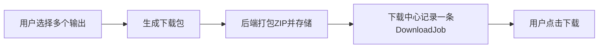

### API（建议）

| 接口 | 方法 | 说明 |
|---|---|---|
| `/api/v1/download-jobs` | POST | 创建打包任务 |
| `/api/v1/download-jobs` | GET | 列表 |
| `/api/v1/download-jobs/:id` | GET | 详情/下载链接 |

### 验收标准（DoD）
- 批量下载会生成记录；
- 下载链接过期后可重新生成（或提示过期并重建）。

---

## 7. 数据同步与模板下发

### 7.1 官方模板下发范围
- 官方工作流模板
- 官方套图模板
- 推荐案例
- 各功能的 presets（动态表单与提示词片段）

### 7.2 同步策略（建议）
- 前台启动时拉取 `templates + presets`，本地缓存版本号；
- 当版本变化时提示“已更新官方玩法”，并刷新模板库/套图模板选择器；
- 失败降级：使用本地缓存，不阻断主流程。

## 8. 非功能需求（NFR）

### 8.1 性能
- 列表类页面首屏 < 2s（含缓存策略）
- 大图预览使用缩略图/懒加载

### 8.2 可用性与容错
- 后端错误码统一映射用户提示（可配置文案）
- 支持断网提示与重试

### 8.3 安全
- token 不可明文暴露在 URL
- 下载链接使用短期签名 URL

## 9. 埋点与运营数据（建议）

> 可先定义事件名与字段，后续接入埋点 SDK。

- `task_create`：featureKey、presetId、inputCount、source（upload/myspace/collection/workflow）
- `task_success` / `task_failed`：duration、errorCode、provider
- `workflow_run_create`：nodeCount、branchCount
- `asset_add_tag`：tagId、assetIdCount
- `publish_export`：platform、productCount

