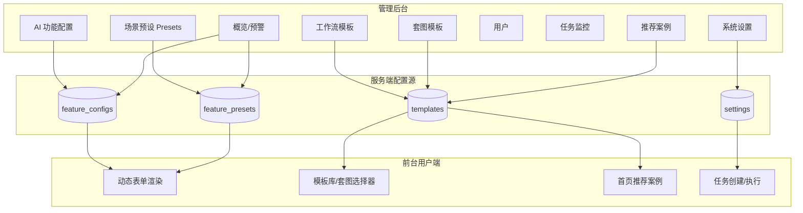
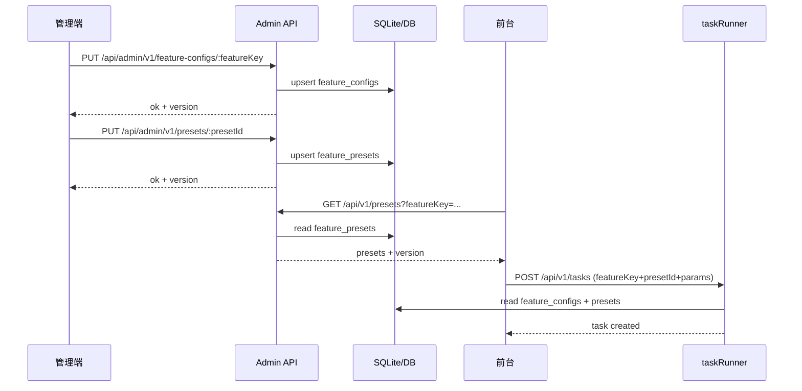
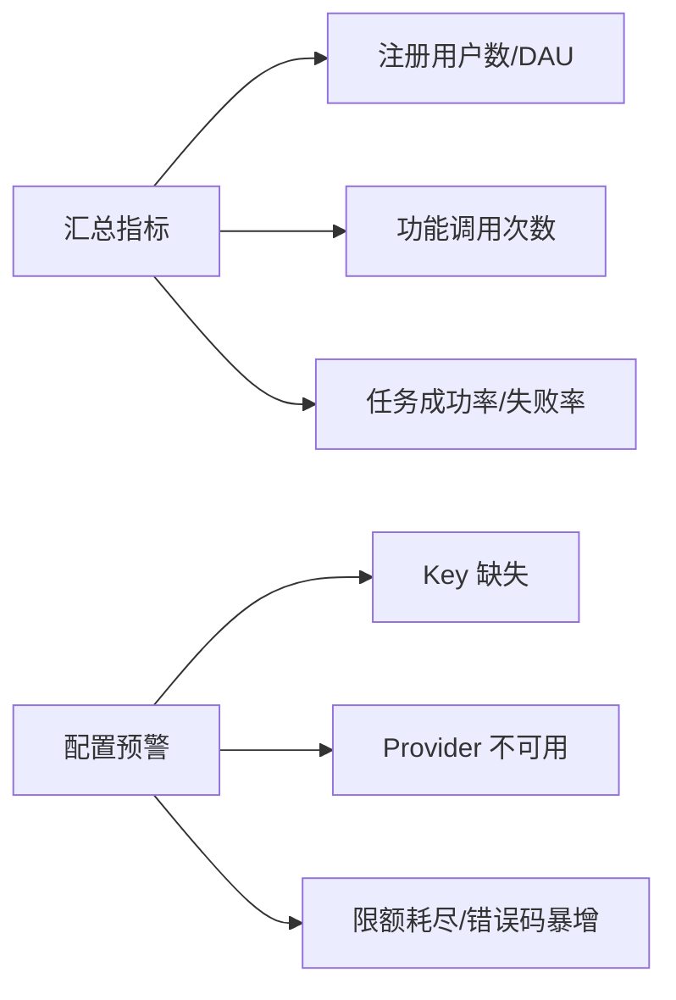
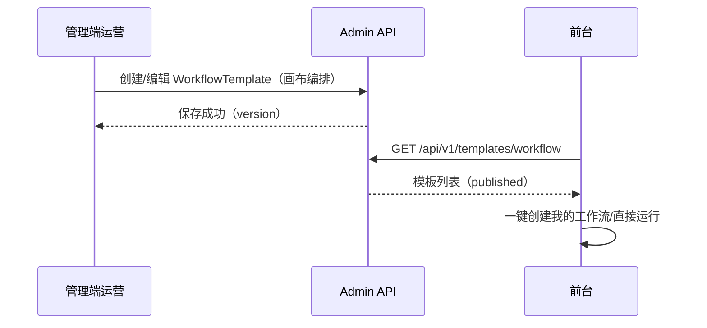

# GOGO POD 管理后台 - 产品需求文档（开发详版）

> 本文档在原《PRD-GOGOPOD-管理后台.md》基础上做“面向研发可落地”的细化：补齐数据结构/API/配置生效链路/异常与验收标准，并为每个模块提供可视化“图片说明”（Mermaid 图）。

## 0. 文档信息

- 产品：GOGO POD
- 端：管理后台（Web，独立入口 `admin.html`）
- 面向读者：产品 / 后端 / 前端 / 测试 / 运维 / 运营
- 关联文档：
  - 原 PRD：`docs/PRD-GOGOPOD-管理后台.md`
  - 管理端说明（重要：动态表单与提示词合成规则）：`docs/后台管理说明.md`
  - 前台 PRD（开发详版）：`docs/PRD-GOGOPOD-前台-开发详版.md`

## 1. 产品定位与目标

### 1.1 定位
管理后台是支撑前台运转的“配置与运营中枢”，核心职责：

1. **AI 能力配置与路由**：Provider、模型、Key、API URL、限额等。
2. **动态表单与场景预设（Presets）**：决定前台每个功能的 UI 控件、默认值、可见性、以及 Prompt 片段拼装。
3. **平台运营模板管理**：推荐案例、官方工作流模板、官方套图模板。
4. **平台治理**：用户账号、任务监控、系统设置、预警。

### 1.2 本期目标（研发可验收）

- 管理端的 FeatureConfig / Preset 配置**写入服务端**并**对前台实时/准实时生效**（不再只存 localStorage）。
- 前台在加载/使用功能时可拉取对应 presets，并按配置渲染动态表单。
- 任务监控可查询平台任务执行状态与失败原因，支持重试/废弃（至少有入口与 API 预留）。

### 1.3 入口与环境

| 地址 | 说明 |
|---|---|
| `/admin.html` | 推荐独立入口 |
| `/admin` | 可选：自动跳转 |

## 2. 角色与权限（管理端）

建议 RBAC（最小可用）：

| 角色 | 说明 | 权限范围 |
|---|---|---|
| 系统管理员 Admin | 全权限 | 所有模块 |
| 运营 Ops | 运营模板为主 | Recommendations / WorkflowTemplates / ProductSetTemplates / Users（可选） |
| AI 工程师 AI-Eng | 配置 AI 能力与预设 | FeatureConfig / Presets / Tasks（只读或可操作） |
| 只读 Viewer | 观察与排查 | Dashboard / Tasks（只读） |

> 若本期不做 RBAC：至少要做“管理员 Token”校验 + 基础登录态；并在 PRD 中标注后续补齐 RBAC。

## 3. 信息架构（IA）

### 3.1 模块列表

1. 概览 Dashboard
2. AI 功能配置 Feature Configuration
3. 场景预设 Presets（动态表单 + Prompt）
4. 推荐案例 Recommendations
5. 工作流模板 Workflow Templates
6. 套图模板 Product Set Templates
7. 用户账号 Users
8. 任务监控 Tasks
9. 系统设置 Settings

### 3.2 全局关系（图片说明）



## 4. 配置生效链路（核心）

### 4.1 核心原则：单一事实源（SSOT）

- **服务端（DB）是唯一事实源**：管理端改配置 → 写 DB → 前台/任务执行读取 DB 生效。
- 前端 localStorage 仅允许作为：
  - 登录态缓存；
  - UI 草稿（可选）；
  - 配置拉取失败时的临时缓存（必须带版本号与过期）。

### 4.2 生效链路（图片说明）



## 5. 模块详述（每个模块含“图片说明”）

---

## 5.1 概览 Dashboard

### 目标
- 提供“平台健康度”与“运营关键指标”一屏汇总；
- 对关键缺失配置进行预警（如 provider key 缺失、限额耗尽）。

### 图片说明（指标与预警流）



### 数据口径（建议）
- 用户数：Users 表
- 调用次数：Tasks 表按 featureKey 聚合
- 成功率：`succeeded / (succeeded+failed)`

### API（建议）
| 接口 | 方法 | 说明 |
|---|---|---|
| `/api/admin/v1/dashboard/metrics` | GET | 指标聚合 |
| `/api/admin/v1/dashboard/alerts` | GET | 预警列表 |

### 验收标准（DoD）
- 无数据时空态可用；
- 有缺失 key 时明确提示到“哪个 featureKey / 哪个 provider”。

---

## 5.2 AI 功能配置（Feature Configuration）

### 定位（与现有实现对齐）
参考 `docs/后台管理说明.md`：AI 功能配置**仅维护**功能基础信息与模型/密钥；动态表单与提示词在 Presets 里维护。

### 图片说明（配置项结构）

```mermaid
flowchart TB
  A[FeatureConfig] --> B[基础信息: 名称/说明/启用]
  A --> C[模型路由: provider/model_id/api_url]
  A --> D[密钥: api_key(加密存储)]
  A --> E[参数映射: ui->provider params(可选)]
  A --> F[限额: perUser/perDay/perFeature]
```

### 功能点
- 列表：按 featureKey 展示启用状态、当前 provider、最近更新时间
- 详情编辑：
  - provider（枚举）
  - api_url（可选，部分 provider 固定）
  - model_id
  - api_key（敏感字段：只允许“覆盖更新”，不回显明文）
  - 启用开关
  - 限额（可选：简单版）
- 校验：
  - 必填字段缺失禁止保存
  - 关闭功能后，前台隐藏入口或置灰（产品决策：建议置灰并提示）

### 数据结构（建议）

```ts
type FeatureConfig = {
  featureKey: string
  name: string
  description?: string
  enabled: boolean
  provider: string
  apiUrl?: string
  modelId?: string
  // 注意：apiKey 仅写入，不回显
  quota?: {
    perUserPerDay?: number
    perUserPerHour?: number
  }
  version: number
  updatedAt: string
}
```

### API（建议）
| 接口 | 方法 | 说明 |
|---|---|---|
| `/api/admin/v1/feature-configs` | GET | 列表 |
| `/api/admin/v1/feature-configs/:featureKey` | GET | 详情 |
| `/api/admin/v1/feature-configs/:featureKey` | PUT | 更新（upsert） |

### 验收标准（DoD）
- 保存后刷新仍能读回（来自服务端）；
- api_key 不回显，二次编辑不覆盖除非重新输入；
- enabled=false 时前台对应功能不可用（隐藏或置灰策略一致）。

---

## 5.3 场景预设 Presets（动态表单 + Prompt 合成）

### 定位
Presets 决定前台某功能的“场景 Tab”、表单控件、默认值、可见性与提示词片段拼装规则。

### 关键规则（来自现有说明）

```
完整提示词 = 场景基础提示词
         + 各可见控件的 promptFragment（{{value}} 替换为用户值）
         + 选中选项的 promptFragment
```

### 图片说明（动态表单配置模型）

```mermaid
flowchart TB
  P[Preset(场景)] --> A[基础: presetId/featureKey/name/enabled/order]
  P --> B[formSchema: controls[]]
  P --> C[prompt: basePrompt + fragments]
  B --> D[control: radio/select/slider/checkbox/text/number]
  D --> E[options? -> each option has subControls[]]
  D --> F[visibility rules (optional)]
```

### 功能点
- Preset 列表（按 featureKey 分组）
- 场景编辑：
  - 场景基础信息：名称、排序、启用
  - 表单控件树：支持“选项子控件”
  - Prompt 预览：实时合成结果（右侧预览）
  - 前台预览：以“拟真 UI”的方式预览控件展示（可先做简化版）
- 合并策略（从现状迁移到服务端后的建议）：
  - 若前端本地有旧 localStorage 配置：仅作为一次性迁移脚本的数据源，不再运行时合并

### 控件类型（建议枚举，与现有对齐）
| 类型 | 用途 |
|---|---|
| radio | 模式选择、背景色等 |
| select | 比例、商品类型 |
| slider | 参考强度、发散强度 |
| checkbox | 开关类选项 |
| text / textarea | prompt 输入、补充信息 |
| numberStepper | 出图数量 1/2/4/6/8 |

### 数据结构（建议，JSON Schema 风格）

```ts
type Preset = {
  presetId: string
  featureKey: string
  name: string
  enabled: boolean
  order: number
  formSchema: {
    controls: Control[]
  }
  promptSchema?: {
    basePrompt: string
  }
  version: number
  updatedAt: string
}

type Control =
  | {
      id: string
      type: "radio" | "select"
      label: string
      defaultValue: string
      options: {
        label: string
        value: string
        promptFragment?: string
        subControls?: Control[]
      }[]
      promptFragment?: string
    }
  | {
      id: string
      type: "slider"
      label: string
      min: number
      max: number
      step: number
      defaultValue: number
      promptFragment?: string
    }
  | {
      id: string
      type: "checkbox"
      label: string
      defaultValue: boolean
      promptFragment?: string
    }
  | {
      id: string
      type: "text" | "textarea"
      label: string
      defaultValue?: string
      promptFragment?: string
    }
  | {
      id: string
      type: "numberStepper"
      label: string
      allowed: number[]
      defaultValue: number
      promptFragment?: string
    }
```

### API（建议）
| 接口 | 方法 | 说明 |
|---|---|---|
| `/api/admin/v1/presets` | GET | 支持 `featureKey` 过滤 |
| `/api/admin/v1/presets/:presetId` | GET | 详情 |
| `/api/admin/v1/presets/:presetId` | PUT | 更新 |
| `/api/admin/v1/presets` | POST | 新增 |
| `/api/admin/v1/presets/:presetId` | DELETE | 删除（软删优先） |

### 验收标准（DoD）
- 保存后前台刷新即可看到表单变更（或在 1 分钟内生效，需定义缓存策略）；
- Prompt 预览与前台实际提交的 prompt 保持一致（抽样验证）。

---

## 5.4 推荐案例 Recommendations

### 目标
为前台首页“推荐玩法/案例”提供可运营内容（图文/视频卡片）。

### 图片说明（内容流）


### 字段（建议）
- title、description、tags[]
- coverAssetId、mediaAssetId（可选）
- linkType：跳转到模板/功能页/外链
- status：draft/published

### API（建议）
| 接口 | 方法 | 说明 |
|---|---|---|
| `/api/admin/v1/recommendations` | GET/POST | 列表/创建 |
| `/api/admin/v1/recommendations/:id` | PUT/DELETE | 更新/删除 |
| `/api/v1/templates/recommendations` | GET | 前台拉取 |

### 验收标准（DoD）
- 前台首页能展示已发布内容；
- 下线后前台不可见（缓存失效策略一致）。

---

## 5.5 工作流模板 Workflow Templates

### 目标
将“可视化工作流编排”能力用于运营下发：管理员预连线并固化参数，前台一键复用。

### 图片说明（模板到前台复用）



### 字段（建议）
- name、description、cover
- workflowDefinition（nodes/edges）
- status：draft/published/disabled
- version、updatedAt

### API（建议）
| 接口 | 方法 | 说明 |
|---|---|---|
| `/api/admin/v1/workflow-templates` | GET/POST | 列表/创建 |
| `/api/admin/v1/workflow-templates/:id` | PUT/DELETE | 更新/删除 |
| `/api/v1/templates/workflow` | GET | 前台拉取 |

### 验收标准（DoD）
- 前台可见并可一键跑通（至少 1 个官方模板）；
- 模板停用后前台不可创建（或提示不可用）。

---

## 5.6 套图模板 Product Set Templates

### 目标
维护商品样机底图、蒙版、缩略图等，为前台“商品套图”能力提供模板来源。

### 图片说明（模板结构）

```mermaid
flowchart TB
  A[ProductSetTemplate] --> B[品类: tshirt/phonecase/...]
  A --> C[底图 assetId]
  A --> D[蒙版 maskAssetId]
  A --> E[缩略图 thumbnailAssetId]
  A --> F[建议画布尺寸/锚点/安全区(可选)]
```

### 功能点
- 模板入库：上传底图/蒙版/缩略图
- 预览：在后台做“套图预览”（可选：用占位印花合成）
- 启用/停用与排序

### API（建议）
| 接口 | 方法 | 说明 |
|---|---|---|
| `/api/admin/v1/product-set-templates` | GET/POST | 列表/创建 |
| `/api/admin/v1/product-set-templates/:id` | PUT/DELETE | 更新/删除 |
| `/api/v1/templates/product-set` | GET | 前台拉取 |

### 验收标准（DoD）
- 前台套图模块能选择到至少 1 个模板并合成成功；
- 模板资源丢失时（OSS 文件不存在）后台提示并阻止发布。

---

## 5.7 用户账号 Users

### 目标
管理前台登录用户账号（开设、停用、配额/权限策略入口）。

### 图片说明（生命周期）


### API（建议）
| 接口 | 方法 | 说明 |
|---|---|---|
| `/api/admin/v1/users` | GET/POST | 列表/创建 |
| `/api/admin/v1/users/:id` | PUT | 更新（状态/备注/策略） |
| `/api/admin/v1/users/:id/reset-password` | POST | 重置密码（可选） |

### 验收标准（DoD）
- 新建用户可在前台登录；
- 停用后前台提示“账号已停用”并禁止进入。

---

## 5.8 任务监控 Tasks

### 目标
全站任务排队与执行状态查表，辅助排查与人工干预。

### 图片说明（排查路径）

```mermaid
flowchart TB
  A[任务列表] --> B[筛选: featureKey/状态/时间/userId]
  B --> C[任务详情]
  C --> D[输入/参数/输出]
  C --> E[错误码/traceId/日志]
  C --> F[操作: 重试/废弃/取消(可选)]
```

### API（建议）
| 接口 | 方法 | 说明 |
|---|---|---|
| `/api/admin/v1/tasks` | GET | 列表（支持筛选） |
| `/api/admin/v1/tasks/:id` | GET | 详情 |
| `/api/admin/v1/tasks/:id/retry` | POST | 重试 |
| `/api/admin/v1/tasks/:id/cancel` | POST | 取消（可选） |

### 验收标准（DoD）
- 能按状态筛选并查看失败原因；
- 重试后任务状态与记录可追溯（新任务 or 同任务重置，需一致）。

---

## 5.9 系统设置 Settings

### 目标
维护全局密钥与环境项：Admin Token、OSS/S3、网关配置等。

### 图片说明（配置分类）

```mermaid
flowchart LR
  A[Settings] --> B[身份校验: Admin Token]
  A --> C[存储: OSS/S3 Bucket/Key]
  A --> D[网关: baseUrl/签名密钥]
  A --> E[全局开关: 维护模式/灰度(可选)]
```

### 安全要求
- 敏感字段加密存储；
- 只允许“覆盖更新”，不回显明文；
- 保存有审计记录（本期可先记操作日志）。

### API（建议）
| 接口 | 方法 | 说明 |
|---|---|---|
| `/api/admin/v1/settings` | GET | 获取 |
| `/api/admin/v1/settings` | PUT | 更新 |

### 验收标准（DoD）
- 更新后服务端读取到新配置；
- 错误配置（如 bucket 缺失）会在 Dashboard 告警。

## 6. 数据库表（建议，SQLite）

> 原 PRD 提到 Express + SQLite：`feature_configs`, `feature_presets`。此处给出建议字段，便于研发对齐。

### 6.1 feature_configs

| 字段 | 类型 | 说明 |
|---|---|---|
| feature_key | TEXT PK | 如 `cutout` |
| name | TEXT | 展示名 |
| description | TEXT | 描述 |
| enabled | INTEGER | 0/1 |
| provider | TEXT | provider 枚举 |
| api_url | TEXT | 可空 |
| model_id | TEXT | 可空 |
| api_key_cipher | TEXT | 加密后密钥 |
| quota_json | TEXT | JSON |
| version | INTEGER | 乐观锁/版本号 |
| updated_at | TEXT | ISO 时间 |

### 6.2 feature_presets

| 字段 | 类型 | 说明 |
|---|---|---|
| preset_id | TEXT PK | 全局唯一 |
| feature_key | TEXT | 外键 |
| name | TEXT | 场景名（前台 Tab） |
| enabled | INTEGER | 0/1 |
| order_no | INTEGER | 排序 |
| form_schema_json | TEXT | JSON |
| prompt_schema_json | TEXT | JSON（可空） |
| version | INTEGER | 版本 |
| updated_at | TEXT | ISO 时间 |

### 6.3 templates（可合表或分表）

按模板类型存储：
- workflow_templates
- product_set_templates
- recommendations

## 7. 缓存与版本策略（建议）

- Admin 写入成功返回 `version`
- 前台拉取时带 `If-None-Match`（ETag）或 `version` 对比
- presets/模板变化频率不高：可缓存 5~10 分钟；支持“强制刷新”按钮用于排查

## 8. 统一错误码（建议）

| 错误码 | 说明 | 管理端提示 |
|---|---|---|
| `AUTH_REQUIRED` | 未登录/Token 失效 | 跳转登录 |
| `PERMISSION_DENIED` | 无权限 | 显示无权限页 |
| `VALIDATION_ERROR` | 参数校验失败 | 表单高亮字段 |
| `CONFLICT_VERSION` | 版本冲突 | 提示刷新后重试 |
| `PROVIDER_KEY_MISSING` | Key 缺失 | 引导去 FeatureConfig/Settings |

